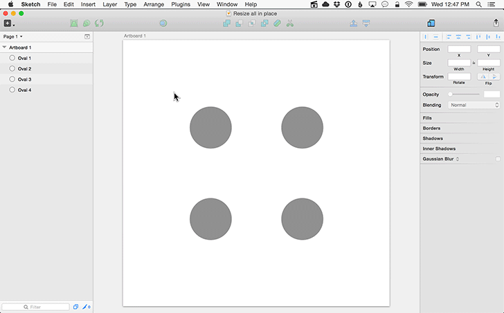

Sketch plugin: Scale all in place
=================

Sketch plugin to scale all selected layers, in place, from center.

## Demo

## Installation

1. [Download the latest release](https://github.com/delighted/sketch-scale-all-in-place/releases/latest) and unzip it.
2. Double click "sketch-scale-all-in-place.sketchplugin"

## Usage

1. Select more than one layer.
2. Navigate to "Plugins > Scale all in place".
3. Type the percentage scale and click "OK".

## Feedback

Send any comments, concerns, or suggestions to [mike@delighted.com](mailto:mike@delighted.com)

## Contributing

1. Fork it
2. Create your feature branch (`git checkout -b my-new-feature`).
3. Commit your changes (`git commit -am 'Add some feature'`).
4. Push to the branch (`git push origin my-new-feature`).
5. Create new Pull Request.
